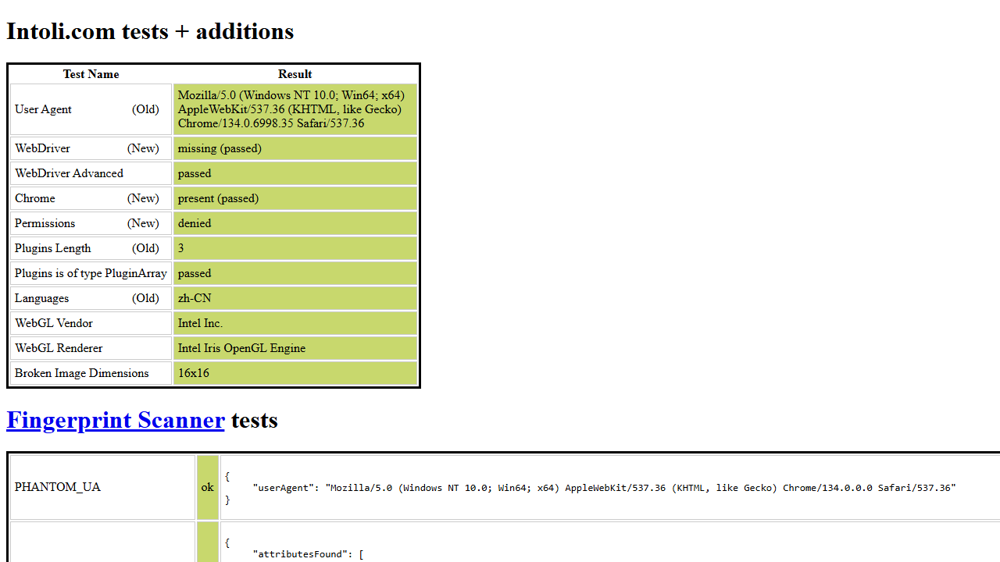

在使用 Selenium、Puppeteer、playwright 等自动化工具进行爬虫时，其实很容易被反爬虫系统发现。

可以用谷歌浏览器打开`https://bot.sannysoft.com`网址查看一下，这些都是浏览器的特征。


对比一下，再使用 playwright 正常模式打开此网页，结果如下：

对比发现，WebDriver 存在差异

再对比一下，再使用 playwright 无头模式打开此网页，结果如下：

情况更是惨不忍睹

为了隐藏这些差异，可以使用 playwright 的 stealth 插件，操作如下：

安装

```javascript
npm install playwright-extra puppeteer-extra-plugin-stealth
```

使用

```javascript
import { chromium } from 'playwright-extra';
import Stealth from 'puppeteer-extra-plugin-stealth';

chromium.use(chromium.use(Stealth()););
const browser = await chromium.launch();
const context = await browser.newContext();
const page = await context.newPage();
await page.goto('https://bot.sannysoft.com');
```

再查看一下结果

正常模式：


无头模式：


可以看到，使用了 stealth 插件后，红色差异已经消失。但是，并不是用了就可以高枕无忧了，这是一场猫和老鼠的游戏
